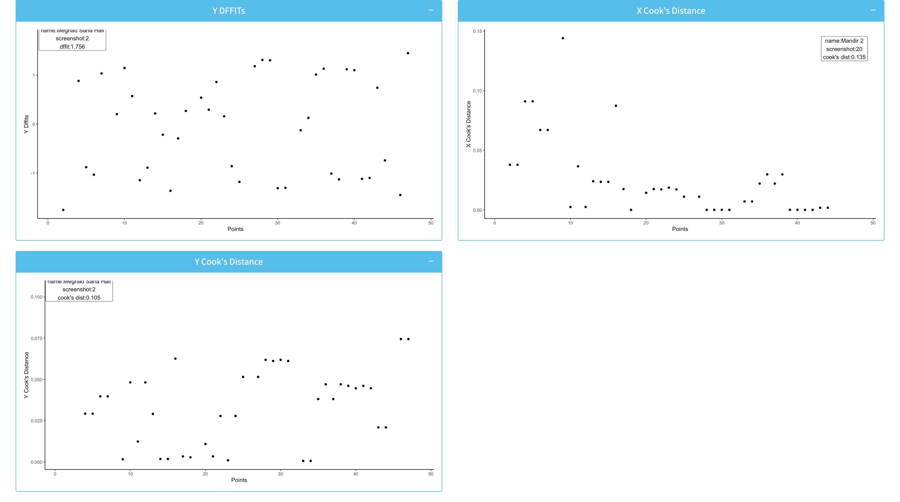

# Map Location Finder

## Problem
Consider a region small enough so that earth's curvature may be ignored, yet large enough so that Google map cannot fit it in a single screen at high resolution. We cover the region with a number of overlapping screenshots of the same or different resolutions. To understand the subsequent steps we focus on overlapping screenshots. There are known locations that I can identify at the current resoluton of that particular screenshot. Note that there are common locations in the overlapping part of screenshots. For each screenshot find the approx pixel coordinate of known locations wrt to the screenshots. Thus our data set consists of a subset of $(r_{ij},c_{ij})$'s for $i=1,...,n_{screenshots}$, and $j=1,...,n_{locations}$. Of course, not all $(i,j)$ pairs occur in the data, since the $j^{th}$ location may not show up in the $i^{th}$ screenshot. Here $r_{ij}$ is the distance (in pixels) of the point from the left side of the screenshot on the image. Similarly, $c_{ij}$ from the top of the screenshot.

Let $(\mu_j,\lambda_j)$ be the true position of the $j^{th}$ location (w.r.t. some global coordinate system).

We can set up a linear model to estimate $(\mu_j,\lambda_j)$'s from the data.  Now I want to represent all the known points in a single plot with respect to there real relative position using a linear model.

## Theory

### Linear Model

After clicking on locations my data set consists of a subset of $(r_{ijk},c_{ijk})$'s for $i=1,...,n_{screenshots}$, and $j=1,...,n_{locations}$ and $k$ corresponds to the error term, which is assumed to be homoscedastic and iid.

Let $(\mu_j,\lambda_j)$ be the true position of the $j^{th}$ location (w.r.t. some global coordinate system). Now, the only source of variation that affects the relative position $(r_{ij}, c_{ij})$ is the screenshot $(x_i, y_i)$ and the random error $\varepsilon_{ijk}$ (obviously, the location which we are estimating matters as that is the true value to which these variations get added to result in relative position from the true position). 

#### Linear Model for Same Resolution Screenshots

For $x$-coordinate:

$$
r_{ijk} = \mu_j + x_i + \varepsilon_{ijk}
$$

For $y$-coordinate:

$$
c_{ijk} = \lambda_j + y_i + \varepsilon_{ijk}
$$

#### Linear Model for Different Resolution Screenshots

The idea is very simple, as the resolution of the screenshots vary, we map the relative location of each of the points to a common screenshot resolution, say the first screenshot. Let, the first screenshot have the resolution (in terms )

TBD

### Rank of the Linear Model

Since, the screenshots are connected by the locations. The rank of the Linear Model is: $n_{screenshots} + n_{locations} - 1$, where $n_{locations}$ is the number of unique locations.

## Implementation

I have implemented the entire application as an R Shiny Web App (Still not hosted). You can run it by running `app6.R` through R, make sure to install the required dependencies. A quick overview/walkthrough of the app is shown below,
- Start Up Page: Upload the map screenshots in `JPEG` Format and proceed next by clicking the `Markup Map Screenshots` button.

- Mark Up Page: Mark the uploaded map screenshots one by one, each mark will result in a black circle been put on the map. And each click on the map will ask for a `Location Name`. Continue this and keep on marking the screenshots. It is allowed to go ahead or come back to a screenshot later to mark again if you missed some locations. `Next` and `Previous` buttons will help you navigate through the screenshots. Whereas, you can scroll the screenshot images to move around a particular screenshot. After you reach the final screenshot `Finish` button appears. Click the finish.

- After a `Success!` prompt, the vector map is generated along with residual and influential point analysis. Each of the plots and Vector Map is interactive, with hover function enabled. You can hover over the points to get further detail about each point as shown below.

#### Note
- The App might be bit sluggish with large number of screenshots.
- Kindly, report any unexpected errors.
- It will be hosted soon! Stay tuned.
